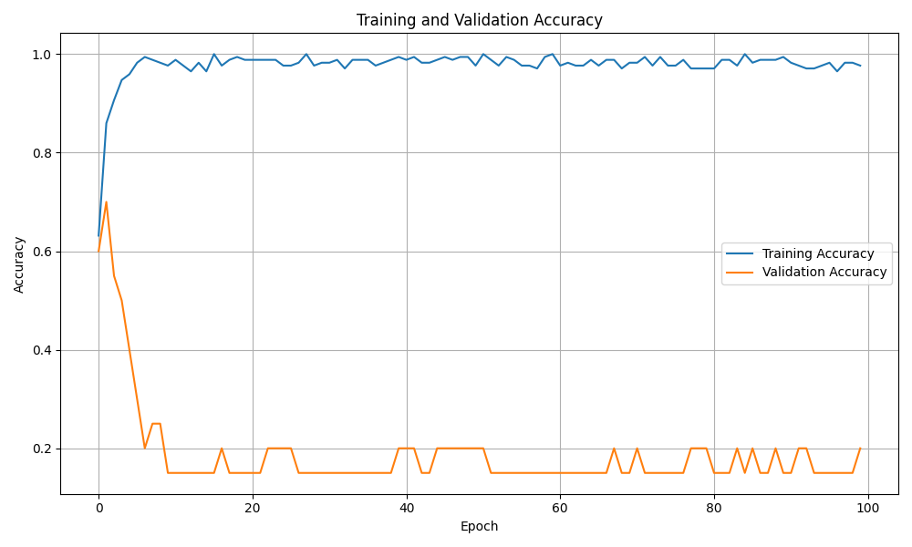
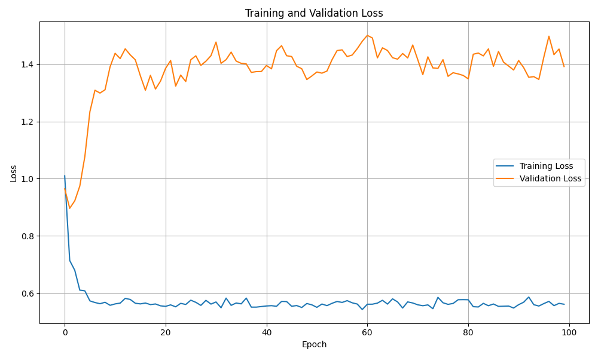
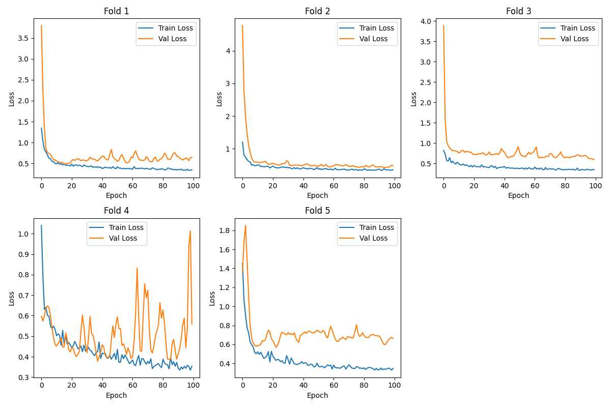
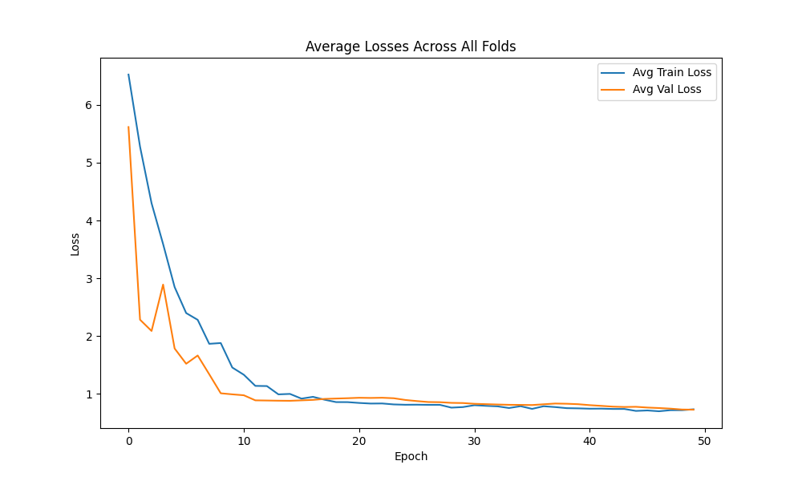
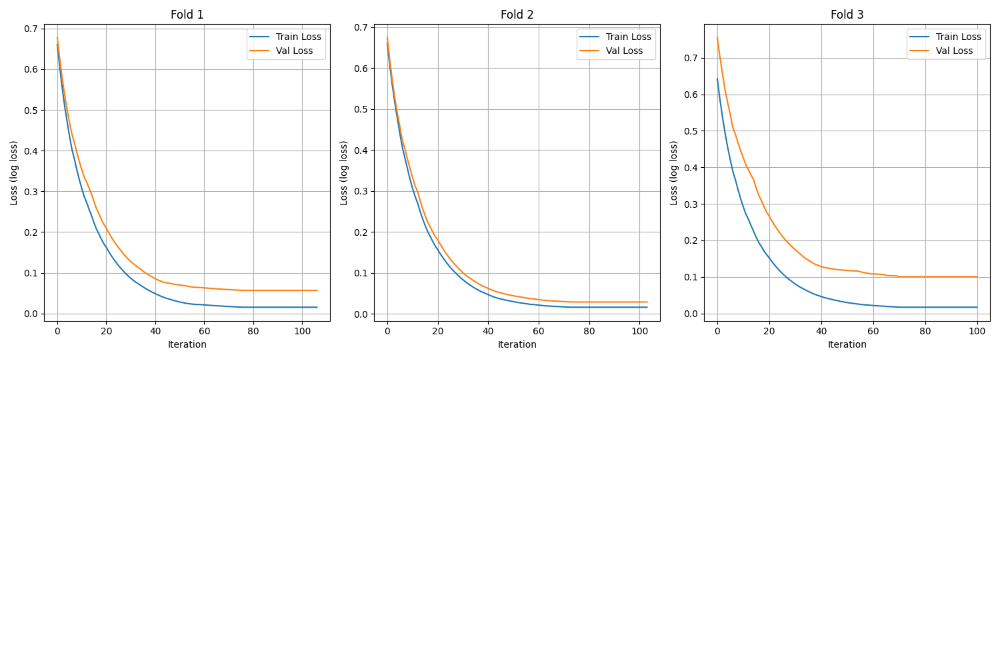
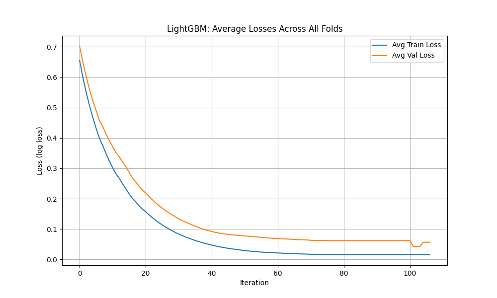
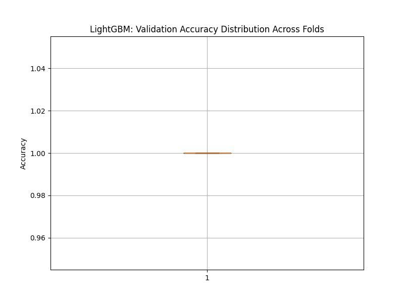

# Boxing Match Predictor: Advanced ML-Powered Fight Outcome Prediction System

## Project Overview

The **Boxing Match Predictor** is a sophisticated machine learning system designed to forecast boxing match outcomes with high precision. This project leverages both deep learning architectures (Multi-Layer Perceptron - MLP) and state-of-the-art gradient boosting techniques (LightGBM) to analyze comprehensive boxer statistics and historical match data. The system employs robust validation methods including k-fold cross-validation to ensure reliable and generalizable predictions.

### Key Features

- **Dual Model Architecture**: Combines the power of neural networks and gradient boosting
- **Advanced Cross-Validation**: Implements 5-fold stratified cross-validation for robust model evaluation
- **Comprehensive Data Analysis**: Processes extensive boxer statistics and historical match data
- **Flexible Inference System**: Supports multiple model types and custom data inputs
- **Rich Visualization**: Detailed performance metrics and training progress visualization

## Model Performance Visualization

### MLP Model Performance

*Figure 1: MLP Model's Training and Validation Accuracy Over Time*


*Figure 2: MLP Model's Training and Validation Loss Curves*

### K-Fold Cross-Validation Results

*Figure 3: Loss Curves Across Different K-Fold Splits*


*Figure 4: Average Loss Performance Across All Folds*

### LightGBM Model Performance

*Figure 5: LightGBM Training Progress*


*Figure 6: LightGBM Average Loss Performance*

<!-- 
*Figure 7: Distribution of Prediction Accuracies in LightGBM Model* -->

## Table of Contents

- [Project Overview](#project-overview)
- [Installation](#installation)
- [Data Preparation](#data-preparation)
- [Model Training](#model-training)
  - [MLP Training](#mlp-training)
  - [K-Fold Cross-Validation](#k-fold-cross-validation)
  - [LightGBM Training](#lightgbm-training)
- [Inference System](#inference-system)
- [Usage Examples](#usage-examples)
- [Technical Requirements](#technical-requirements)

## Installation

1. **Clone the Repository**
   ```bash
   git clone https://github.com/yourusername/boxing-match-predictor.git
   cd boxing-match-predictor
   ```

2. **Set Up Python Environment**
   ```bash
   python3 -m venv env
   source env/bin/activate  # On Windows: env\Scripts\activate
   ```

3. **Install Dependencies**
   ```bash
   pip install -r requirements.txt
   ```

## Data Preparation

The system requires properly formatted and preprocessed data files in the `data_src/` directory:

- `train.csv`: Primary training dataset
- `validation.csv`: Validation dataset for model evaluation
- `combined_data.csv`: Unified dataset for k-fold and LightGBM training
- `inference_data.csv`: Test dataset for predictions

## Model Training

### MLP Training

Train the neural network model with optimized hyperparameters:

```bash
python train.py
```

Features:
- Automated data normalization
- Dynamic learning rate adjustment
- Best model checkpoint saving
- Performance visualization

### K-Fold Cross-Validation

Execute robust 5-fold cross-validation training:

```bash
python train_k_fold.py
```

Benefits:
- Stratified fold splitting for balanced training
- Comprehensive model evaluation
- Automated best model selection
- Detailed performance visualization across folds

### LightGBM Training

Train the gradient boosting model with cross-validation:

```bash
python train_k_lgb.py
```

Advantages:
- High-speed training with GPU support
- Feature importance analysis
- Robust handling of missing values
- Advanced regularization techniques

## Inference System

### MLP/K-Fold Model Inference

```bash
python inference.py --model_type [kfold|mlp] [--model_path PATH] [--data_path PATH]
```

Options:
- `--model_type`: Select between `kfold` or `mlp` architectures
- `--model_path`: Custom model file path (optional)
- `--data_path`: Custom inference data path (optional)

### LightGBM Model Inference

```bash
python inference_lgb.py
```

Features:
- Probability distribution output
- Confidence scoring
- Fast batch processing
- Detailed prediction analysis

## Usage Examples

1. **Standard MLP Training:**
   ```bash
   python train.py
   ```

2. **Cross-Validation Training:**
   ```bash
   python train_k_fold.py
   ```

3. **LightGBM Training:**
   ```bash
   python train_k_lgb.py
   ```

4. **MLP Model Inference:**
   ```bash
   python inference.py --model_type mlp
   ```

5. **K-Fold Model Inference:**
   ```bash
   python inference.py --model_type kfold
   ```

6. **LightGBM Inference:**
   ```bash
   python inference_lgb.py
   ```

## Technical Requirements

### Core Dependencies
- Python 3.6+
- PyTorch (Latest stable)
- LightGBM
- NumPy
- Pandas
- Scikit-learn
- Matplotlib

### Installation

```bash
pip install -r requirements.txt
```

Required packages:
```
torch>=1.9.0
lightgbm>=3.3.0
numpy>=1.19.5
pandas>=1.3.0
scikit-learn>=0.24.2
matplotlib>=3.4.3
```

## Challenges and Future Improvements

### Current Challenges

#### 1. Data Limitations
- **Limited Dataset Size**
  - Restricted model performance due to small sample size
  - Challenges in achieving robust generalization
  - Increased risk of overfitting

- **Class Imbalance Issues**
  - Difficulty in predicting "draw" outcomes in MLP and K-Fold models
  - Bias towards more frequently occurring classes
  - Required special handling in model architecture

#### 2. Model Adaptations
- **LightGBM Specific Adjustments**
  - Modified class weights to reduce penalties for "draw" predictions
  - Increased model complexity to better handle edge cases
  - Implemented custom penalties to prevent excessive draw predictions

### Future Improvements

#### 1. Data Enhancement
- **Dataset Expansion**
  - Collect additional historical match data
  - Implement data augmentation techniques
  - Create synthetic samples while maintaining data integrity

- **Feature Engineering**
  - Incorporate advanced features:
    - Recent match performance trends
    - Opponent strength metrics
    - Match context and conditions
    - Fighter career trajectories
    - Weight class transition history

#### 2. Model Optimization
- **Advanced Training Techniques**
  - Implement sophisticated hyperparameter optimization
  - Explore ensemble methods:
    - Model stacking
    - Blending LightGBM with neural networks
    - Voting classifiers with weighted predictions

- **Architecture Improvements**
  - Experiment with different neural network architectures
  - Implement attention mechanisms for feature importance
  - Develop custom loss functions for better handling of draws

#### 3. System Enhancements
- **Real-time Processing**
  - Develop streaming data pipeline for live updates
  - Implement real-time prediction adjustments

- **Interpretability**
  - Add feature importance visualization
  - Implement SHAP (SHapley Additive exPlanations) values
  - Create detailed prediction explanation system

## License

This project is licensed under the MIT License. See the [LICENSE](LICENSE) file for details. 